---
## Front matter
title: " Лабораторная работа №5"
subtitle: "Создание и
процесс обработки программ на языке
ассемблера NASM"
author: "Грачева Мария Валерьевна"

## Generic otions
lang: ru-RU
toc-title: "Содержание"

## Bibliography
bibliography: bib/cite.bib
csl: pandoc/csl/gost-r-7-0-5-2008-numeric.csl

## Pdf output format
toc: true # Table of contents
toc-depth: 2
lof: true # List of figures
lot: true # List of tables
fontsize: 12pt
linestretch: 1.5
papersize: a4
documentclass: scrreprt
## I18n polyglossia
polyglossia-lang:
  name: russian
  options:
	- spelling=modern
	- babelshorthands=true
polyglossia-otherlangs:
  name: english
## I18n babel
babel-lang: russian
babel-otherlangs: english
## Fonts
mainfont: PT Serif
romanfont: PT Serif
sansfont: PT Sans
monofont: PT Mono
mainfontoptions: Ligatures=TeX
romanfontoptions: Ligatures=TeX
sansfontoptions: Ligatures=TeX,Scale=MatchLowercase
monofontoptions: Scale=MatchLowercase,Scale=0.9
## Biblatex
biblatex: true
biblio-style: "gost-numeric"
biblatexoptions:
  - parentracker=true
  - backend=biber
  - hyperref=auto
  - language=auto
  - autolang=other*
  - citestyle=gost-numeric
## Pandoc-crossref LaTeX customization
figureTitle: "Рис."
tableTitle: "Таблица"
listingTitle: "Листинг"
lofTitle: "Список иллюстраций"
lotTitle: "Список таблиц"
lolTitle: "Листинги"
## Misc options
indent: true
header-includes:
  - \usepackage{indentfirst}
  - \usepackage{float} # keep figures where there are in the text
  - \floatplacement{figure}{H} # keep figures where there are in the text
---

# Цель работы

Целью работы является освоение процедуры компиляции и сборки программ, написанных на ассемблере NASM.

# Выполнение лабораторной работы

Переходим в каталог lab05 (рис. [-@fig:001])

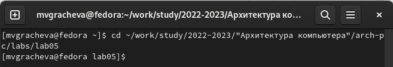{ #fig:001 width=70% }

Создаю текстовый файл с именем hello.asm 
 
`touch hello.asm`

открываю этот файл 

`gedit hello.asm`

(рис. [-@fig:003]) 

и ввожу в него текст рис. ([-@fig:004])

`; hello.asm`

`SECTION .data ;                  Начало секции данных`

`    hello:            DB 'Hello world!',10 ; 'Hello world!' плюс`
     
`                                            ; символ перевода строки`
                                            
`     helloLen: EQU $-hello                  ; Длина строки hello`
     
     
`SECTION .text       ; Начало секции кода`

`   GLOBAL _start`
   
  
`_start:               ; Точка входа в программу`

`     mov eax,4        ; Системный вызов для записи (sys_write)`
     
`     mov ebx,1        ; Описатель файла '1' - стандартный вывод`
     
`     mov ecx,hello    ; Адрес строки hello в ecx`
     
`     mov edx,helloLen ; Размер строки hello`
     
`     int 80h          ; Вызов ядра`
     
`     mov eax,1        ; Системный вызов для выхода (sys_exit)`
     
`     mov ebx,0        ; Выход с кодом возврата '0' (без ошибок)`
     
`     int 80h          ; Вызов ядра`

(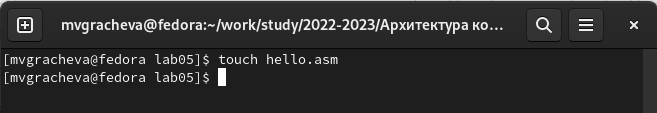{ #fig:002 width=70% }

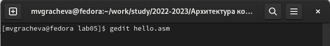{ #fig:003 width=70% }

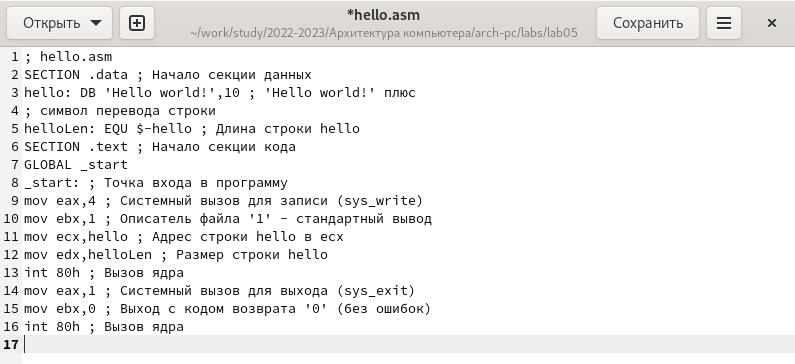{ #fig:004 width=70% }

Ввожу команду nasm (рис. [-@fig:005])

`nasm -f elf hello.asm`

 и проверяю наличие нового объектного файла (рис. [-@fig:006])
 
 `ls`

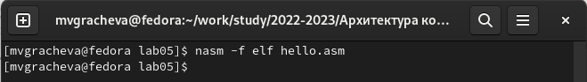{ #fig:005 width=70% }

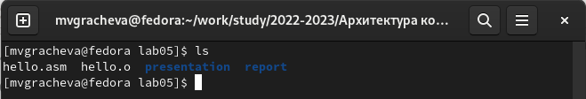{ #fig:006 width=70% }

Скомпилирую исходный файл (рис. [-@fig:007]) 

`nasm -o obj.o -f elf -g -l list.lst hello.asm`

и проверяю наличие файла list.lst (рис. [-@fig:008])

`ls`

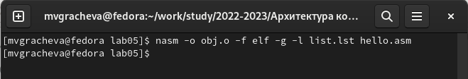{ #fig:007 width=70% }

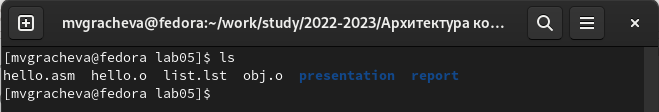{ #fig:008 width=70% }

Передаю объектный файл на обработку компоновщику (рис. [-@fig:009]) 

`ld -m elf_i386 hello.o -o hello`

и проверяю наличие файла hello (рис. [-@fig:010]) 

`ls`

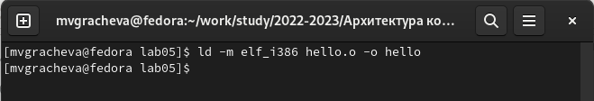{ #fig:009 width=70% }

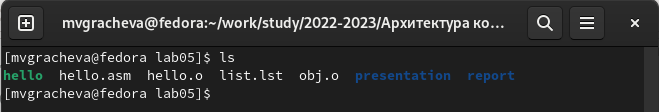{ #fig:010 width=70% }

Передаю новый объектный файл на обработку компоновщику (рис. [-@fig:011]) 

`ld -m elf_i386 obj.o -o main`

Видим новый исполняемый файл main, использовали объектный файл obj.o

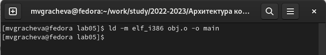{ #fig:011 width=70% }

Запускаю исполняемый файл (рис. [-@fig:012])

`./hello`

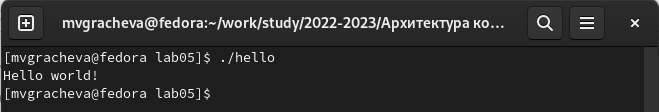{ #fig:012 width=70% }

# Задание для самостоятельной работы

Создаю копию файла hello.asm с названием lab05 (рис. [-@fig:013])

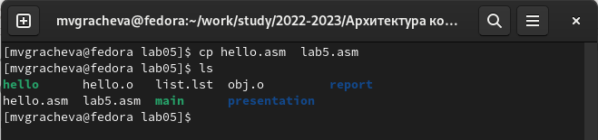{ #fig:013 width=70% }

Вношу изменения в текст (рис. [-@fig:014])

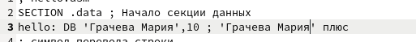{ #fig:014 width=70% }

Оттранслирую полученный текст программы lab5.asm в объектный
файл (рис. [-@fig:015]) . Выполняю компоновку объектного файла (рис. [-@fig:016]) и запускаю получившийся исполняемый файл (рис. [-@fig:017])

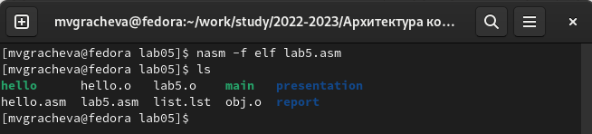{ #fig:015 width=70% }

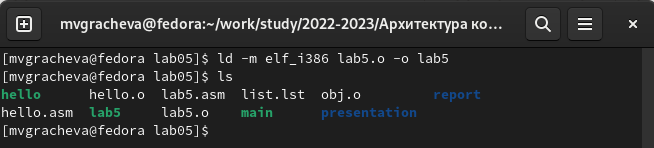{ #fig:016 width=70% }

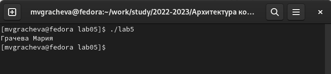{ #fig:017 width=70% }

Загружаю файлы в репозиторий (рис. [-@fig:018])

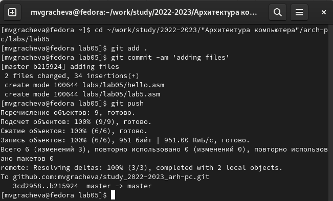{ #fig:018 width=70% }

# Выводы

В ходе лабораторной работы я освоила процедуры компиляции и сборки программ, написанных на ассемблере NASM.

